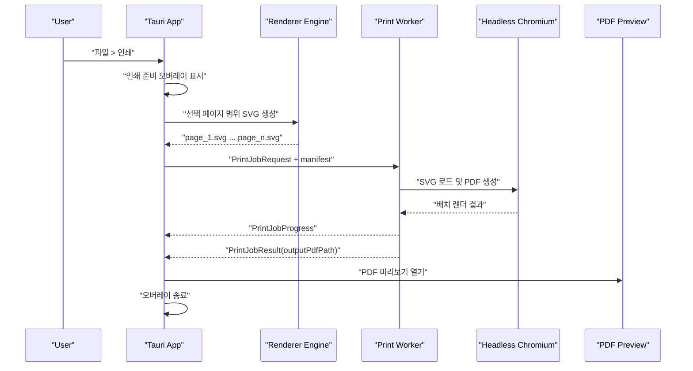

# Puppeteer Print Pipeline Plan

## 목표

- 기존 정확한 렌더 엔진을 유지한다.
- 브라우저 `window.print()` 기반 미리보기 병목을 우회한다.
- 대용량 문서 인쇄 시 메인 앱 프리징을 방지한다.
- 오프라인 및 망 분리 환경에서도 동작하는 로컬 출력 파이프라인을 구축한다.

## 채택 전략

- 기본 인쇄 경로는 당분간 그대로 유지한다.
- 신규 경로는 `Puppeteer` 기반의 별도 인쇄 워커 프로세스로 구현한다.
- 메인 앱은 페이지별 SVG를 생성하고, 워커는 이를 PDF로 변환한다.
- 사용자에게는 PDF 뷰어 기반 미리보기를 제공한다.

## 후보 비교 요약

### paged.js

- 장점: HTML/CSS 기반 도입이 쉬움
- 단점: 브라우저 엔진 의존, 대용량에서 프리징 및 메모리 리스크 큼
- 판단: 우리 환경에는 부적합

### PDFKit 직접 렌더

- 장점: 고정 출력 포맷, 브라우저 인쇄 엔진 우회 가능
- 단점: 페이지 나눔과 배치 정합성을 다시 구현해야 함
- 판단: 장기 연구용은 가능하나 단기 운영 경로로는 위험

### Puppeteer

- 장점: 메인 스레드와 분리된 별도 프로세스, 로컬 Chromium 기반 PDF 생성 가능
- 단점: 바이너리 번들 및 프로세스 생명주기 관리 필요
- 판단: 대용량, 오프라인, 정합성 우선 요구에 가장 적합

## 핵심 아키텍처

### 구성 요소

- 메인 앱(Tauri)
  - 인쇄 요청 수집
  - SVG 배치 생성
  - 진행률 UI
  - 워커 프로세스 생성/감시/종료
- 인쇄 워커(Node + Puppeteer)
  - SVG 파일 로드
  - PDF 생성
  - 진행률/결과 보고
- PDF 미리보기
  - 결과 PDF 파일 또는 Blob URL 오픈

## IPC 계약

### PrintJobRequest

```ts
type PrintJobRequest = {
  jobId: string;
  sourceFileName: string;
  outputMode: 'preview' | 'save-pdf';
  pageRange: {
    type: 'all' | 'currentPage' | 'pageRange';
    startPage?: number;
    endPage?: number;
    currentPage?: number;
  };
  batchSize: number;
  tempDir: string;
  outputPdfPath: string;
  pageCount: number;
  pageSize: {
    widthPx: number;
    heightPx: number;
    dpi: 96;
  };
  svgPagePaths: string[];
};
```

### PrintJobProgress

```ts
type PrintJobProgress = {
  jobId: string;
  phase: 'spawned' | 'loading' | 'rendering-batch' | 'writing-pdf' | 'completed';
  completedPages: number;
  totalPages: number;
  batchIndex?: number;
  message: string;
};
```

### PrintJobResult

```ts
type PrintJobResult = {
  jobId: string;
  ok: boolean;
  outputPdfPath?: string;
  durationMs: number;
  errorCode?: string;
  errorMessage?: string;
};
```

## 프로세스 분리 전략

### 생성 정책

- 메인 앱은 인쇄 요청마다 별도 워커 프로세스를 실행한다.
- 워커는 로컬 Node 런타임과 Puppeteer 스크립트로 구성한다.
- 워커 인자는 최소화하고, 대량 데이터는 JSON 파일 또는 temp manifest로 전달한다.

### 종료 정책

- 정상 완료 시:
  - `PrintJobResult.ok=true` 수신
  - 출력 PDF 존재 확인
  - 워커 종료 대기
- 오류 시:
  - 오류 이벤트 수신 즉시 종료 시도
- 사용자 취소 시:
  - cancel 플래그 전송
  - 짧은 유예 후 강제 종료
- 타임아웃 시:
  - 프로세스 kill
  - temp 자원 정리

### 좀비 프로세스 방지

- 메인 앱이 각 워커 PID를 추적한다.
- 워커 종료 감시 타이머를 둔다.
- 앱 종료 이벤트에서 살아 있는 워커를 모두 정리한다.
- 비정상 종료 복구를 위해:
  - 시작 시 temp 디렉터리의 stale manifest/pdf/svg 정리
  - 이전 세션의 orphan worker 흔적 로그 점검

### 앱 비정상 종료 시나리오

1. 앱이 크래시 또는 강제 종료
2. 워커는 부모 프로세스 heartbeat 파일 또는 stdin 종료를 감시
3. 부모 생존 신호가 끊기면 워커는 자체 종료
4. 다음 앱 실행 시 stale temp 파일 정리

권장:
- 워커가 `stdin` 종료 또는 heartbeat timeout을 감지하면 종료
- 메인 앱은 `jobId` 단위 temp 경로를 사용하고, 앱 시작 시 오래된 경로를 청소

## 오프라인/망 분리 환경용 Chromium 번들 전략

### 원칙

- 네트워크 다운로드에 의존하지 않는다.
- Chromium 실행 파일을 제품과 함께 번들하거나, 명시된 로컬 경로에서만 사용한다.

### 권장 전략

1. 포터블/설치형에 Chromium 런타임 포함
2. 앱 설정에서 실행 경로를 고정
3. 워커는 외부 인터넷 없이 오직 로컬 파일만 읽음

### 경로 정책

- 설치형:
  - 앱 설치 디렉터리 하위 `runtime/chromium/...`
- 포터블:
  - 실행 파일 기준 상대 경로 `runtime/chromium/...`

### 버전 전략

- 앱 버전과 Chromium 버전을 묶어서 검증
- 자동 업데이트 없음
- 새 릴리스에서만 교체

## 비즈니스 로직 분리

### 메인 앱 책임

- 페이지 범위 계산
- `renderPageSvg(pageIndex)` 호출
- SVG를 temp 파일로 저장
- 워커 실행
- 진행률 UI 표시
- 완료 시 PDF 미리보기 오픈

### 워커 책임

- manifest 읽기
- SVG 파일 로드
- Puppeteer로 PDF 생성
- 진행률 이벤트 전송
- 결과 반환

## 시퀀스 다이어그램



## 7단계 실행 계획

### 1단계 인터페이스 설계

- `PrintJobRequest/Progress/Result` 타입 정의
- 워커 실행 정책 정의
- 검증:
  - 요청/응답 예제 문서화
  - 오류 코드 표준화

### 2단계 런타임 전략 확정

- Chromium 번들 위치와 실행 정책 정의
- 검증:
  - 오프라인 환경에서 headless 기동 확인

### 3단계 최소 PDF 프로토타입

- 1~5페이지 SVG로 PDF 생성
- 검증:
  - 페이지 수 일치
  - 표/이미지 기본 위치 비교

### 4단계 1~20페이지 미리보기

- 진행률 UI 연결
- 검증:
  - 앱 본체 프리징 없는지 확인
  - 미리보기 전환 시간 비교

### 5단계 중간 규모 검증

- 100~300페이지 테스트
- 검증:
  - 메모리 사용량
  - 워커 종료 후 자원 회수

### 6단계 1,000+ 페이지 대용량 검증

- 대용량 문서 전체 출력 테스트
- 검증:
  - 메인 앱 responsiveness 유지
  - 타임아웃/취소/재시도 시나리오

### 7단계 운영 연동 판단

- 기본 `[파일]->[인쇄]` 대체 여부 결정
- 검증:
  - 포터블/설치형 모두 확인
  - 사용자 시나리오 회귀 테스트

## 정합성 검증 기준

비교 기준:
- 현재 정확한 기존 인쇄 결과

비교 항목:
- 총 페이지 수
- 표 구조와 선 정합성
- 이미지 위치와 크기
- 페이지 나눔
- 머리말/꼬리말 위치
- 본문 블록 시작 위치

검증 순서:
- 1~5페이지 샘플 수동 비교
- 20페이지 비교
- 표/이미지 중심 문서 비교
- 100페이지 이상 중간 검증
- 1,000페이지 이상 대용량 검증

## 채택 전제

- 새 Puppeteer 경로가 충분한 정합성과 대용량 안정성을 입증하기 전까지
  기본 `[파일]->[인쇄]` 경로는 유지한다.
