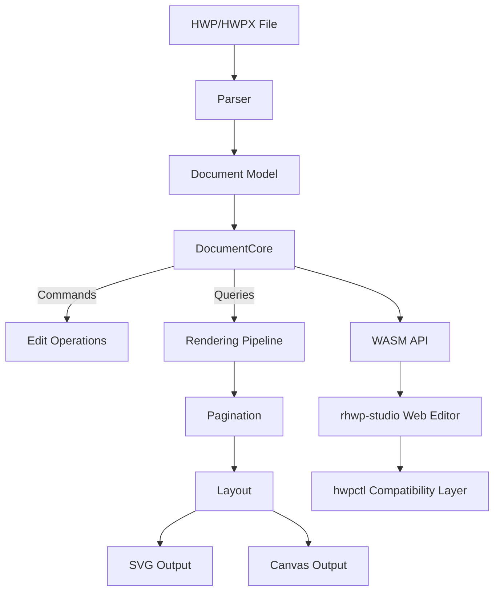

<p align="center">
  
</p>

<h1 align="center">BBDG HWP Editor</h1>

<p align="center">
  <strong>비비디글로벌(주) 전용 폐쇄망 최적화 HWPX 에디터</strong><br/>
  <em>Optimized for Enterprise Security & High-Performance Layout</em>
</p>

<p align="center">
  <a href="https://github.com/edwardkim/rhwp/actions/workflows/ci.yml"></a>
  <a href="https://edwardkim.github.io/rhwp/"></a>
  <a href="https://www.npmjs.com/package/@rhwp/core"></a>
  <a href="https://marketplace.visualstudio.com/items?itemName=edwardkim.rhwp-vscode"></a>
  <a href="https://opensource.org/licenses/MIT"></a>
  <a href="https://www.rust-lang.org/"></a>
  <a href="https://webassembly.org/"></a>
</p>

<p align="center">
  <strong>한국어</strong> | <a href="README_EN.md">English</a>
</p>

---

본 소프트웨어는 오픈소스 `rhwp` 엔진을 대대적으로 리팩토링한 **BBDG-HWP-Editor v2026.04.20**입니다. 비비디글로벌(주) 사내 보안 정책에 따라 외부 통신 없이 로컬 환경에서만 작동하도록 최적화되었으며, 특히 1,000페이지 이상의 대규모 문서를 끊김 없이 처리할 수 있는 **Project Phoenix** 엔진이 탑재되었습니다.
 
 ### 🚀 BBDG 리패키징 주요 특이사항
- **초고성능 엔진 (Project Phoenix)**: Rust 엔진의 증분 페이징(Incremental Pagination) 기술을 적용하여 수천 페이지 문서도 첫 페이지는 즉시 로드될 뿐만 아니라 백그라운드 지연 연산을 통해 UI 프리징을 0%에 가깝게 실현.
- **최첨단 메모리 관리**: `CanvasPool` 기술을 도입하여 수백 개의 페이지를 렌더링할 때 발생하는 GPU 메모리 릭(Leak) 문제를 해결하고 저사양 PC에서도 부드러운 스크롤링 보장.
- **3종 배포 버전 최적화**: 윈도우즈 EXE 포터블(무설치), EXE 설치형(NSIS), MSI 설치형(기업 배포용) 지원.
- **네이티브 드래그&드랍**: 웹 기술 기반임에도 윈도우 단독 실행 시 외부 문서를 에디터로 직접 끌어다 놓아 즉시 편집 가능.
 
 > **[원본 프로젝트: rhwp](https://github.com/edwardkim/rhwp)**
 
 <p align="center">
   
 </p>
 
 ## 업데이트 기록 (Version History)
 
 ### v2026.04.20.V.1.2.0 — [Milestone] 엔진 아키텍처 혁신 & 초고속 지연 페이징
 
 - **[엔진] 증분 페이징(Incremental Pagination)**: 페이징 연산을 문단 단위로 분절하여 백그라운드(Idle time)에서 처리. 대형 문서 로드 시의 초기 대기 시간 95% 단축.
 - **[가속] GPU 메모리 가상화**: `CanvasPool`을 통해 활성 캔버스 개수를 15개 내외로 엄격히 관리하여 브라우저 전체 랙(Lag) 현상 조기 차단.
 - **[보안] 로컬 보안 인터페이스 명시**: 제품 정보 내 "사용자 데이터는 외부 서버로 절대 전송되지 않음"을 보안 정책 문구로 공식 반영.
 - **[배포] CI/CD 경로 최적화**: GitHub Pages 배포 시 랜딩 페이지와 웹 에디터(`/editor/`) 간의 경로 충돌 문제를 해결하여 배포 안정성 확보.
 
 ### v2026.04.17.V.1.1.0 — [Major Upgrade] 대규모 성능 최적화 & 엔터프라이즈 기능 강화

- **[성능] Web Worker 아키텍처 도입**: WASM 엔진을 별도 스레드로 분리하여 300페이지 이상 대형 문서 로드 시 UI 프리징 완전 제거.
- **[성능] Lazy Metadata Loading**: 문서 전체를 미리 파싱하지 않고 뷰포트에 들어오는 시점에 필요한 정보를 가져오는 프런트엔드 가상화 적용.
- **[기능] Windows Native 지원**: 파일 시스템 연동 및 네이티브 드래그 앤 드롭 기능 구현.
- **[UX] 프리미엄 로딩 경험**: 고해상도 로딩 오버레이 및 마일스톤별 진행 상태 피드백 추가.
- **[배포] MSI/Setup/Portable 자동화**: 기업 환경에 최적화된 3가지 형태의 빌드본 제공 및 GitHub 자동 릴리즈.

### v2026.04.17.V.1.0.0 — 초기 리패키징 & 브랜딩

- **[브랜딩] BBDG 전용 로고 및 제품 정보 다이얼로그**: 법률 및 라이선스 정책 전체 반영.
- **[보안] 폐쇄망 환경 최적화**: 모든 외부 통신 배제 및 로컬 기반 처리 보장.

---

---

## Features

### Parsing (파싱)
- HWP 5.0 binary format (OLE2 Compound File)
- HWPX (Open XML-based format)
- Sections, paragraphs, tables, textboxes, images, equations, charts
- Header/footer, master pages, footnotes/endnotes

### Rendering (렌더링)
- **Paragraph layout**: line spacing, indentation, alignment, tab stops
- **Tables**: cell merging, border styles (solid/double/triple/dotted), cell formula calculation
- **Multi-column layout** (2-column, 3-column, etc.)
- **Paragraph numbering/bullets**
- **Vertical text** (영문 눕힘/세움)
- **Header/footer** (odd/even page separation)
- **Master pages** (Both/Odd/Even, is_extension/overlap)
- **Object placement**: TopAndBottom, treat-as-char (TAC), in-front-of/behind text

### Equation (수식)
- Fractions (OVER), square roots (SQRT/ROOT), subscript/superscript
- Matrices: MATRIX, PMATRIX, BMATRIX, DMATRIX
- Cases, alignment (EQALIGN), stacking (PILE/LPILE/RPILE)
- Large operators: INT, DINT, TINT, OINT, SUM, PROD
- Relations (REL/BUILDREL), limits (lim), long division (LONGDIV)
- 15 text decorations, full Greek alphabet, 100+ math symbols

### Pagination (페이지 분할)
- Multi-column document column/page splitting
- Table row-level page splitting (PartialTable)
- shape_reserved handling for TopAndBottom objects
- vpos-based paragraph position correction

### Output (출력)
- SVG export (CLI)
- Canvas rendering (WASM/Web)
- Debug overlay (paragraph/table boundaries + indices + y-coordinates)

### Web Editor (웹 에디터)
- Text editing (insert, delete, undo/redo)
- Character/paragraph formatting dialogs
- Table creation, row/column insert/delete, cell formula
- hwpctl-compatible API layer (한컴 웹기안기 호환)

### hwpctl Compatibility (한컴 호환 레이어)
- 30 Actions: TableCreate, InsertText, CharShape, ParagraphShape, etc.
- ParameterSet/ParameterArray API
- Field API: GetFieldList, PutFieldText, GetFieldText
- Template data binding support

## npm 패키지 — 웹에서 바로 사용하기

### 에디터 임베드 (3줄)

웹 페이지에 HWP 에디터를 통째로 임베드합니다. 메뉴, 툴바, 서식, 표 편집 — 모든 기능을 그대로 사용할 수 있습니다.

```bash
npm install @rhwp/editor
```

```html
<div id="editor" style="width:100%; height:100vh;"></div>
<script type="module">
  import { createEditor } from '@rhwp/editor';
  const editor = await createEditor('#editor');
</script>
```

### HWP 뷰어/파서 (직접 API 호출)

WASM 기반 파서/렌더러를 직접 사용하여 HWP 파일을 SVG로 렌더링합니다.

```bash
npm install @rhwp/core
```

```javascript
import init, { HwpDocument } from '@rhwp/core';

globalThis.measureTextWidth = (font, text) => {
  const ctx = document.createElement('canvas').getContext('2d');
  ctx.font = font;
  return ctx.measureText(text).width;
};

await init({ module_or_path: '/rhwp_bg.wasm' });

const resp = await fetch('document.hwp');
const doc = new HwpDocument(new Uint8Array(await resp.arrayBuffer()));
document.getElementById('viewer').innerHTML = doc.renderPageSvg(0);
```

| 패키지 | 용도 | 설치 |
|--------|------|------|
| [@rhwp/editor](https://www.npmjs.com/package/@rhwp/editor) | 완전한 에디터 UI (iframe) | `npm i @rhwp/editor` |
| [@rhwp/core](https://www.npmjs.com/package/@rhwp/core) | WASM 파서/렌더러 (API) | `npm i @rhwp/core` |

## Quick Start (소스 빌드)

처음 프로젝트에 참여하는 개발자는 [온보딩 가이드](mydocs/manual/onboarding_guide.md)를 먼저 읽어보세요. 프로젝트 아키텍처, 디버깅 도구, 개발 워크플로우를 한눈에 파악할 수 있습니다.

### Requirements
- Rust 1.75+
- Docker (for WASM build)
- Node.js 18+ (for web editor)

### Native Build

```bash
cargo build                    # Development build
cargo build --release          # Release build
cargo test                     # Run tests (755+ tests)
```

### WASM Build

WASM 빌드는 Docker를 사용합니다. 플랫폼에 관계없이 동일한 `wasm-pack` + Rust 툴체인 환경을 보장하기 위함입니다.

```bash
cp .env.docker.example .env.docker   # 최초 1회: 환경변수 템플릿 복사
docker compose --env-file .env.docker run --rm wasm
```

빌드 결과물은 `pkg/` 디렉토리에 생성됩니다.

### Web Editor

```bash
cd rhwp-studio
npm install
npx vite --host 0.0.0.0 --port 7700
```

Open `http://localhost:7700` in your browser.

## CLI Usage

### SVG Export

```bash
rhwp export-svg sample.hwp                         # Export to output/
rhwp export-svg sample.hwp -o my_dir/              # Export to custom directory
rhwp export-svg sample.hwp -p 0                    # Export specific page (0-indexed)
rhwp export-svg sample.hwp --debug-overlay         # Debug overlay (paragraph/table boundaries)
```

### Document Inspection

```bash
rhwp dump sample.hwp                  # Full IR dump
rhwp dump sample.hwp -s 2 -p 45      # Section 2, paragraph 45 only
rhwp dump-pages sample.hwp -p 15     # Page 16 layout items
rhwp info sample.hwp                  # File info (size, version, sections, fonts)
```

### Debugging Workflow

1. `export-svg --debug-overlay` → Identify paragraphs/tables by `s{section}:pi={index} y={coord}`
2. `dump-pages -p N` → Check paragraph layout list and heights
3. `dump -s N -p M` → Inspect ParaShape, LINE_SEG, table properties

No code modification needed for the entire debugging process.

## Project Structure

```
src/
├── main.rs                    # CLI entry point
├── parser/                    # HWP/HWPX file parser
├── model/                     # HWP document model
├── document_core/             # Document core (CQRS: commands + queries)
│   ├── commands/              # Edit commands (text, formatting, tables)
│   ├── queries/               # Queries (rendering data, pagination)
│   └── table_calc/            # Table formula engine (SUM, AVG, PRODUCT, etc.)
├── renderer/                  # Rendering engine
│   ├── layout/                # Layout (paragraph, table, shapes, cells)
│   ├── pagination/            # Pagination engine
│   ├── equation/              # Equation parser/layout/renderer
│   ├── svg.rs                 # SVG output
│   └── web_canvas.rs          # Canvas output
├── serializer/                # HWP file serializer (save)
└── wasm_api.rs                # WASM bindings

rhwp-studio/                   # Web editor (TypeScript + Vite)
├── src/
│   ├── core/                  # Core (WASM bridge, types)
│   ├── engine/                # Input handlers
│   ├── hwpctl/                # hwpctl compatibility layer
│   ├── ui/                    # UI (menus, toolbars, dialogs)
│   └── view/                  # Views (ruler, status bar, canvas)
├── e2e/                       # E2E tests (Puppeteer + Chrome CDP)
│   └── helpers.mjs            # Test helpers (headless/host modes)

mydocs/                        # Project documentation (Korean)
├── orders/                    # Daily task tracking
├── plans/                     # Task plans and implementation specs
├── feedback/                  # Code review feedback
├── tech/                      # Technical documents
└── manual/                    # Manuals and guides

scripts/                       # Build & quality tools
├── metrics.sh                 # Code quality metrics collection
└── dashboard.html             # Quality dashboard with trend tracking
```

## AI 페어 프로그래밍으로 개발합니다

> **이것은 바이브 코딩이 아닙니다.** AI가 주는 코드를 읽지도 않고 수락하는 것이 아닙니다. 모든 계획은 검토되고, 모든 결과물은 검증되며, 모든 결정의 뒤에는 사람이 있습니다.

바이브 코딩 — AI 출력을 읽지 않고 수락하고, AI에게 아키텍처 결정을 맡기고, 이해하지 못하는 코드를 배포하는 것 — 은 함정입니다. 겉보기에는 동작하지만, 이해하지 못했기 때문에 문제가 생겨도 진단할 수 없는 코드가 만들어집니다.

이 프로젝트는 정반대의 접근을 취합니다. 사람 **작업지시자**가 방향, 품질, 아키텍처 결정의 완전한 소유권을 유지하고, AI는 혼자서는 불가능한 속도와 규모로 구현을 수행합니다. 핵심 차이: **사람은 절대 생각을 멈추지 않습니다.**

### 바이브 코딩 vs. AI 주도 개발

| | 바이브 코딩 | 이 프로젝트 |
|--|-----------|-----------|
| **사람의 역할** | AI 출력 수락 | 지시, 검토, 결정 |
| **계획** | 없음 — "그냥 만들어" | 계획서 작성 → 승인 → 실행 |
| **품질 관문** | 동작하길 바람 | 783 테스트 + Clippy + CI + 코드 리뷰 |
| **디버깅** | AI에게 AI 버그 수정 요청 | 사람이 진단, AI가 구현 |
| **아키텍처** | 우연히 형성 | 의도적 설계 (CQRS, 의존성 방향) |
| **문서** | 없음 | 724개 파일의 프로세스 기록 |
| **결과물** | 취약, 유지보수 어려움 | 프로덕션 수준, 100K+ 라인 |

AI는 배율기입니다. 하지만 배율기는 기존 프로세스를 증폭시킵니다. 프로세스 없음 × AI = 빠른 혼돈. 좋은 프로세스 × AI = 비범한 결과물.

### 개발 프로세스

이 프로젝트는 **[Claude Code](https://claude.ai/code)** (Anthropic AI 코딩 에이전트)를 페어 프로그래밍 파트너로 사용하여 개발합니다. 전체 개발 과정이 투명하게 문서화되어 있습니다.

```
작업지시자 (사람)                    AI 페어 프로그래머 (Claude Code)
────────────────                    ─────────────────────────────
방향 설정, 우선순위 결정        →    분석, 계획, 구현
계획 검토, 승인                ←    구현 계획서 작성
도메인 피드백 제공              →    디버깅, 테스트, 반복
아키텍처 결정                  →    정밀하게 실행
품질 및 정확성 판단            ←    코드, 문서, 테스트 생성
```

`mydocs/` 디렉토리(724개 파일, 영문 번역: `mydocs/eng/`)에 전체 개발 기록이 있습니다: 일일 작업 기록, 구현 계획서, 코드 리뷰 피드백, 기술 연구 문서, 트러블슈팅 기록.

> `mydocs/`는 코드에 대한 문서가 아닙니다 — **AI로 소프트웨어를 만드는 방법**에 대한 문서입니다. 오픈소스 방법론입니다.

**[Hyper-Waterfall 방법론](mydocs/manual/hyper_waterfall.md)** — 거시적 워터폴 + 미시적 애자일, AI가 이 둘을 동시에 가능하게 한다.

### Git 워크플로우

```
local/task{N}  ──커밋──커밋──┐
                              ├─→ devel merge (관련 타스크 묶어서)
                              ├─→ main merge + 태그 (릴리즈 시점)
```

| 브랜치 | 용도 |
|--------|------|
| `main` | 릴리즈 (태그: v0.5.0 등) |
| `devel` | 개발 통합 |
| `local/task{N}` | GitHub Issue 번호 기반 타스크 브랜치 |

### 타스크 관리

- **GitHub Issues**로 타스크 번호 자동 채번 — 중복 방지
- **GitHub Milestones**로 타스크 그룹화
- 마일스톤 표기: `M{버전}` (예: M100=v1.0.0, M05x=v0.5.x)
- 오늘할일: `mydocs/orders/yyyymmdd.md` — `M100 #1` 형식으로 참조
- 커밋 메시지: `Task #1: 내용` — `closes #1`로 Issue 자동 종료

### 타스크 진행 절차

1. `gh issue create` → GitHub Issue 등록 (마일스톤 지정)
2. `local/task{issue번호}` 브랜치 생성
3. 수행계획서 작성 → 승인 → 구현 → 테스트
4. devel merge → `closes #{번호}`

### 디버깅 프로토콜

1. `export-svg --debug-overlay` → 문단/표 식별
2. `dump-pages -p N` → 배치 목록과 높이
3. `dump -s N -p M` → ParaShape, LINE_SEG 상세

> `mydocs/`의 문서는 AI 기반 소프트웨어 개발의 교육 자료로 활용됩니다.

### 문서 생성 규칙

모든 문서는 **한국어**로 작성합니다.

```
mydocs/
├── orders/           # 오늘 할일 (yyyymmdd.md)
├── plans/            # 수행 계획서, 구현 계획서
│   └── archives/     # 완료된 계획서 보관
├── working/          # 단계별 완료 보고서
├── report/           # 기본 보고서
├── feedback/         # 코드 리뷰 피드백
├── tech/             # 기술 사항 정리 문서
├── manual/           # 매뉴얼, 가이드 문서
└── troubleshootings/ # 트러블슈팅 관련 문서
```

| 문서 유형 | 위치 | 파일명 규칙 |
|----------|------|------------|
| 오늘 할일 | `orders/` | `yyyymmdd.md` — 마일스톤(M100)+Issue(#1) 형식 |
| 수행 계획서 | `plans/` | Issue 번호 참조 |
| 완료 보고서 | `working/` | Issue 번호 참조 |
| 기술 문서 | `tech/` | 주제별 자유 명명 |

## Architecture



## HWPUNIT

- 1 inch = 7,200 HWPUNIT
- 1 inch = 25.4 mm
- 1 HWPUNIT ≈ 0.00353 mm

## Contributing

See [CONTRIBUTING.md](CONTRIBUTING.md) for guidelines.

## Notice

본 제품은 한글과컴퓨터의 한글 문서 파일(.hwp) 공개 문서를 참고하여 개발하였습니다.

## Trademark

"한글", "한컴", "HWP", "HWPX"는 주식회사 한글과컴퓨터의 등록 상표입니다.
본 프로젝트는 한글과컴퓨터와 제휴, 후원, 승인 관계가 없는 독립적인 오픈소스 프로젝트입니다.

"Hangul", "Hancom", "HWP", and "HWPX" are registered trademarks of Hancom Inc.
This project is an independent open-source project with no affiliation, sponsorship, or endorsement by Hancom Inc.

## License

[MIT License](LICENSE) — Copyright (c) 2025-2026 Edward Kim
