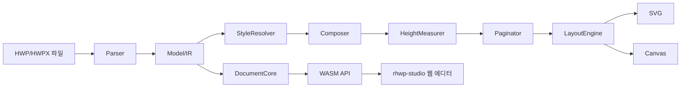

# rhwp 개발 로드맵

**"한컴 웹 HWP의 오픈소스 대안"**

## 현황 요약 (2026년 3월 24일 기준)

### 프로젝트 정체성

Rust + WebAssembly + Canvas 기반의 **HWP 웹 뷰어/에디터 엔진**.
한컴의 웹한글 대신 사용할 수 있는 **MIT 라이선스 오픈소스 대안**.

### 달성 현황

| 영역 | 상태 | 커버리지 |
|------|------|---------|
| HWP 5.0 파싱 | 완료 | 95% |
| HWPX 파싱 | 완료 | 80% |
| 렌더링 (SVG/Canvas) | 완료 | 90% |
| 페이지네이션 | 완료 | 85% |
| 수식 렌더링 | 완료 | 90% |
| 머리말/꼬리말/바탕쪽 | 완료 | 90% |
| 다단 레이아웃 | 완료 | 85% |
| 텍스트 편집 | 완료 | 70% |
| 표 편집 | 완료 | 70% |
| 웹 에디터 UI | 완료 | 60% |
| HWP 직렬화 (저장) | 완료 | 90% |
| WASM 빌드 | 완료 | 100% |

### 규모

| 메트릭 | 값 |
|--------|-----|
| Rust 코드 | 133,000줄 |
| 테스트 | 727개 (단위 + 통합) |
| E2E 시나리오 | 12개 (Puppeteer/CDP) |
| 타스크 완료 | 355개 |
| 코드 리뷰 | 4차 (8.9/10) |

---

## 전체 타임라인

```
2026년
──────────────────────────────────────────────────────────
1월~3월       Foundation: 엔진 구축                ← 완료
              ├─ HWP/HWPX 파서
              ├─ 렌더링 엔진 (SVG/Canvas)
              ├─ 페이지네이션 엔진
              ├─ 수식 파서/렌더러
              ├─ 웹 에디터 (rhwp-studio)
              └─ 디버그 도구 + E2E 테스트

4월           Phase 1: hwpctl 호환 레이어             ← 현재
              ├─ hwpctl API 호환 JavaScript 래퍼
              ├─ TableCreation, ShapeObject 등 핵심 API
              ├─ 기존 웹기안기 코드 무변경 전환 지원
              └─ hwpctl 호환 테스트 스위트

5월           Phase 2: GitHub 공개 준비
              ├─ 코드 품질 9.2점 달성
              ├─ 민감 정보 제거
              ├─ CONTRIBUTING.md + README.en.md
              ├─ Issue/PR 템플릿
              └─ MIT 라이선스 전환

6월           Phase 3: 공개 + 커뮤니티 시동
              ├─ GitHub 공개
              ├─ 데모 사이트 배포
              ├─ npm 패키지 배포
              ├─ crates.io 배포
              └─ 기술 블로그 (한국어/영어)

7월~9월       Phase 4: 에디터 기능 고도화
              ├─ Undo/Redo
              ├─ 클립보드 (복사/잘라내기/붙여넣기)
              ├─ 찾기/바꾸기
              ├─ 그리기 도구
              └─ 인쇄 (window.print / PDF)

10월~12월     Phase 5: 생태계 확장
              ├─ HWP→PDF 변환 (CLI)
              ├─ REST API 서버 (문서 변환 서비스)
              ├─ 플러그인 아키텍처
              └─ i18n (영어 UI)
──────────────────────────────────────────────────────────
```

---

## Phase 1: hwpctl 호환 레이어 (4월)

**목표**: 한컴 웹기안기 hwpctl API와 호환되는 JavaScript 래퍼 구현

### 1-0. hwpctl 호환 API

한컴 웹기안기의 `hwpctl` API와 동일한 인터페이스를 제공하여,
기존 웹기안기 코드를 **변경 없이** rhwp로 전환할 수 있게 한다.

**참조 문서**: `mydocs/manual/hwpctl/hwpctl_ParameterSetID_Item_v1.2.md`

**구현 우선순위**:

| 순위 | hwpctl API | 설명 |
|------|-----------|------|
| P0 | `CreateSet("Table")` + `InsertCtrl` | 표 생성 |
| P0 | `TableCreation` (Rows, Cols, ColWidth, WidthType) | 표 파라미터 |
| P0 | ShapeObject 공통 (TreatAsChar, TextWrap, VertRelTo, HorzRelTo) | 개체 배치 |
| P1 | `TableInsertLine` / `TableDeleteLine` | 행/열 추가/삭제 |
| P1 | `TableSplitCell` | 셀 나누기 |
| P1 | `Header` / `Footer` / `MasterPage` | 머리말/꼬리말/바탕쪽 |
| P2 | `TableStrToTbl` | 문자열→표 변환 |
| P2 | `EqEdit` | 수식 삽입 |
| P2 | `DrawImageAttr` | 이미지 삽입 |

**구현 방식**: `rhwp-studio/src/hwpctl/` 모듈로 JavaScript 호환 래퍼 구현

```javascript
// 한컴 hwpctl 호환 인터페이스
const hwpCtrl = new RhwpCtrl(wasmModule);
const tableSet = hwpCtrl.CreateSet("Table");
tableSet.SetItem("Rows", 10);
tableSet.SetItem("Cols", 6);
tableSet.SetItem("TreatAsChar", false);
tableSet.SetItem("TextWrap", 1);
hwpCtrl.InsertCtrl("Table", tableSet);
```

---

## Phase 2: GitHub 공개 준비 (5월)

**목표**: 코드 품질 9.2점 + 문서 완비 + 민감 정보 제거

### 2-1. 코드 품질 목표 (8.9 → 9.2)

| 항목 | 현재 | 목표 | 작업 |
|------|------|------|------|
| SOLID-S | 8.5 | 9.0 | ✅ layout_column_item 분해 완료 (Task 349) |
| 테스트 | 7.5 | 8.0 | ✅ 통합 테스트 11개 추가 (Task 351) |
| 코드 품질 | 8.5 | 9.0 | ✅ Clippy 28→8, From 표준화 (Task 350) |
| 기술 부채 | 8.5 | 9.0 | ✅ 의존성 제거, unwrap 제거 (Task 346~348) |

### 2-2. 민감 정보 제거

| 항목 | 위치 | 처리 |
|------|------|------|
| GitLab 비밀번호 | CLAUDE.md | 제거 또는 .gitignore |
| SSH 키 경로 | CLAUDE.md | 제거 |
| 내부 서버 IP | CLAUDE.md | 제거 |
| 사내 파일 경로 | CLAUDE.md, 각종 문서 | 정리 |

### 2-3. 공개용 문서 작성

| 문서 | 상태 | 내용 |
|------|------|------|
| README.md | ✅ 작성 완료 | 기능, 빌드, CLI, 구조 |
| README.en.md | 미작성 | 영문 README |
| CONTRIBUTING.md | 미작성 | 기여 가이드 (브랜치, 코딩 컨벤션, PR 규칙) |
| LICENSE | 미작성 | MIT 라이선스 |
| onboarding_guide.md | ✅ 작성 완료 | 디버깅 프로토콜, 피드백 체계 |
| .github/ISSUE_TEMPLATE | 미작성 | 버그 보고, 기능 요청 템플릿 |
| .github/PULL_REQUEST_TEMPLATE | 미작성 | PR 체크리스트 |

### 2-4. 아키텍처 다이어그램

README에 Mermaid.js 다이어그램 추가:



---

## Phase 3: 공개 + 커뮤니티 시동 (6월)

**목표**: GitHub 공개 후 초기 관심 확보

### 3-1. GitHub 공개

- 리포지토리: `github.com/[org]/rhwp`
- 라이선스: MIT
- 포함: 코어 엔진 + WASM + rhwp-studio + mydocs(개발 기록)
- 제외: 사내 전용 설정, 민감 정보

### 3-2. 데모 사이트

- GitHub Pages 또는 Vercel에 rhwp-studio 배포
- 샘플 HWP 파일 로딩 → 브라우저에서 즉시 확인
- URL: `rhwp.dev` 또는 `[org].github.io/rhwp`

### 3-3. 패키지 배포

| 패키지 | 레지스트리 | 내용 |
|--------|-----------|------|
| `rhwp` | crates.io | Rust 코어 라이브러리 |
| `@rhwp/wasm` | npm | WASM 바인딩 |

### 3-4. 기술 블로그

| 주제 | 언어 | 대상 |
|------|------|------|
| "Rust로 HWP 바이너리 포맷 파싱하기" | 한국어 | 한국 개발자 |
| "Building an HWP Word Processor in Rust + WASM" | 영어 | 글로벌 |
| "AI와 인간의 페어 프로그래밍으로 13만줄 프로젝트 만들기" | 한국어/영어 | AI 개발 커뮤니티 |
| "HWP 수식 스크립트 파서를 재귀 하강 파서로 구현하기" | 한국어 | 컴파일러 관심 개발자 |

### 3-5. 초기 노출 채널

| 채널 | 전략 |
|------|------|
| GeekNews (한국) | "한컴 웹한글의 오픈소스 대안 — Rust + WASM" |
| Hacker News | "Show HN: Open-source HWP word processor in Rust + WASM" |
| Reddit r/rust | WASM + Canvas 기술 스택 강조 |
| X (Twitter) | 데모 GIF + 스레드 |

---

## Phase 4: 에디터 기능 고도화 (7월~9월)

**목표**: 웹 에디터로서 실용적 수준 달성

### 4-1. 편집 기능

| 기능 | 우선순위 | 비고 |
|------|---------|------|
| Undo/Redo | 높음 | Command 패턴 기반 |
| 찾기/바꾸기 | 높음 | 정규식 지원 |
| 그리기 도구 (선, 사각형, 원) | 중간 | Shape 모델 활용 |
| 글상자 삽입/편집 | 중간 | TextBox 컨트롤 |
| 이미지 삽입 (드래그&드롭) | 중간 | BinData + Picture |
| 표 스타일 프리셋 | 낮음 | 테두리/배경 조합 |

### 4-2. 렌더링 개선

| 항목 | 현재 | 목표 |
|------|------|------|
| 차트 렌더링 | 미구현 | 기본 차트 (막대/원/선) |
| 각주/미주 렌더링 | 부분 | 완전 |
| 변경 추적 (리비전) | 미구현 | 뷰어 수준 |
| 양면 인쇄 미리보기 | 미구현 | 짝수/홀수 페이지 |

### 4-3. 인쇄

| 방식 | 설명 |
|------|------|
| window.print() | 브라우저 기본 인쇄 (CSS @media print) |
| PDF 내보내기 | Canvas → PDF (jsPDF 또는 서버사이드) |

---

## Phase 5: 생태계 확장 (10월~12월)

### 5-1. HWP→PDF 변환 (CLI)

```bash
rhwp export-pdf sample.hwp output.pdf
```

기존 SVG 렌더링 → `svg2pdf` 또는 직접 PDF 생성.

### 5-2. REST API 서버

```
POST /api/convert/hwp-to-pdf
POST /api/convert/hwp-to-svg
POST /api/render/{page}
GET  /api/info
```

Docker 이미지로 배포. 기업 내 문서 변환 서비스로 활용.

### 5-3. 플러그인 아키텍처

- 커스텀 렌더러 (PDF, PNG 등)
- 커스텀 파서 (DOC, DOCX 등)
- 에디터 확장 (맞춤법 검사, 번역 등)

---

## 미결 기술 과제

| No | 항목 | 상태 | 비고 |
|----|------|------|------|
| 340 | 글머리 문단 탭 정렬 | 미결 | 글머리 폭이 탭 그리드 기준에 포함 |
| B-002 | pagination vpos 동기화 | 미결 | 기존 테스트 2건 수정 필요 |

---

## 차별점

### vs 한컴 웹한글

| 항목 | 한컴 웹한글 | rhwp |
|------|-----------|------|
| 라이선스 | 상용 (유료) | MIT (무료) |
| 기술 스택 | Java/ActiveX 기반 | Rust + WASM + Canvas |
| 소스 공개 | 비공개 | 오픈소스 |
| 커스터마이징 | 불가 | 자유 |
| 브라우저 호환 | IE/Chrome 플러그인 의존 | 모든 모던 브라우저 |
| 서버 의존 | 한컴 서버 필요 | 클라이언트 단독 동작 |

### vs 기존 오픈소스 HWP 프로젝트

| 항목 | libhwp/hwp.js/pyhwp | rhwp |
|------|---------------------|------|
| 파싱 | HWP5 일부 | HWP5 + HWPX |
| 렌더링 | 없음 또는 기본 | 페이지네이션 + 다단 + 수식 |
| 편집 | 없음 | 텍스트/표/서식 편집 |
| 웹 에디터 | 없음 | rhwp-studio (Canvas) |
| 테스트 | 소수 | 727개 + E2E 12개 |
| 코드 규모 | 수천줄 | 133,000줄 |

### 기술적 혁신

| 항목 | 설명 |
|------|------|
| **AI 페어 프로그래밍** | Claude Code와 인간의 협업으로 전 과정 개발 — 개발 기록 전체 공개 |
| **디버깅 프로토콜** | `--debug-overlay` + `dump-pages` + `dump` — 정량적 좌표 기반 소통 |
| **코드 품질 대시보드** | Clippy + CC + 테스트 + 트렌드 차트 — 자동 모니터링 |
| **HWP 스펙 오류 문서화** | 공식 스펙의 오류를 발견하고 실제 바이너리로 검증 — 커뮤니티 자산 |
| **수식 렌더러** | 한컴 수식 스크립트 30+ 명령어를 재귀 하강 파서로 구현 |

---

## 성공 지표

### Phase 3 (공개 후 1개월)

| 지표 | 목표 |
|------|------|
| GitHub Stars | 200+ |
| npm 주간 다운로드 | 50+ |
| 이슈/PR 참여자 | 5+ |
| 데모 사이트 방문 | 1,000+/월 |

### Phase 4 (공개 후 3개월)

| 지표 | 목표 |
|------|------|
| GitHub Stars | 1,000+ |
| 기여자 | 10+ |
| 포크 | 50+ |
| 기업 문의 | 3+ |

### 장기 (12개월)

- "HWP 오픈소스 = rhwp"가 한국 개발자 커뮤니티의 상식
- 공공기관/기업에서 웹 뷰어로 실제 사용 사례 확보

---

*작성: 2026-03-24*
*이전 로드맵: dev_roadmap_v1_backup.md (2026-02-10 작성, AI Agent 도구 중심)*
