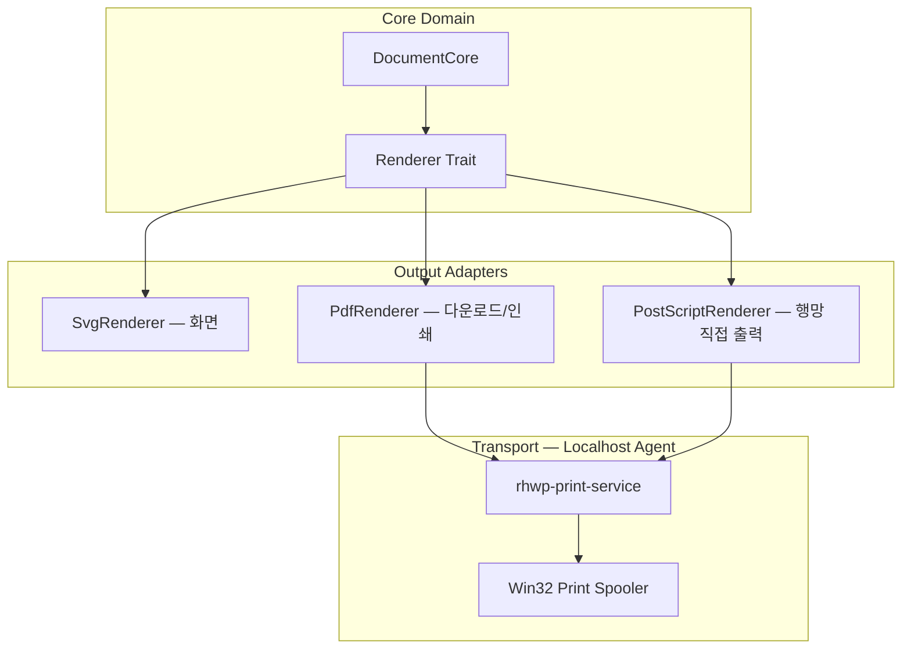

# 기술 가이드라인: rhwp 직접 인쇄 아키텍처

> **대상**: rhwp 개발팀, 아키텍처팀
> **목적**: 브라우저 내 데스크톱 수준 인쇄 경험 실현을 위한 설계 가이드
> **작성일**: 2026-02-23
> **개정일**: 2026-02-23 (v2 — PDF 기반 + Localhost Agent 전략 반영)
> **상세 개발계획**: `mydocs/plans/task_B009.md`

---

## 1. 아키텍처 비전

현재의 웹 기반 인쇄 방식(window.print 또는 PDF 다운로드)은 **8~10단계의 사용자 조작과 2회의 앱 전환**을 요구한다. 경쟁사(한컴 웹기안기, 폴라리스 등)도 PDF 다운로드 수준에 머물러 있다.

rhwp는 **Core Engine에서 PDF/PostScript를 직접 생성**하고, **Localhost Agent를 통해 브라우저 내에서 인쇄를 완결**한다. 사용자는 Ctrl+P → 프린터 선택 → 인쇄, **3단계로 끝난다**.

```
경쟁사:  문서 → PDF 다운로드 → 파일 열기 → PDF 뷰어에서 인쇄  (8~10단계)
rhwp:    문서 → [인쇄] → 프린터 선택 → 출력 완료              (3단계)
```

## 2. 설계 원칙

1. **PDF가 기반**: PDF Renderer 하나로 다운로드와 인쇄를 동시에 해결한다. 어차피 만들어야 하는 기능이다.
2. **PS는 고급 경로**: 공공기관 행망 프린터(전부 PS 지원)에 대해 드라이버를 우회하여 직접 출력한다.
3. **Localhost Agent**: 한국에서 ActiveX 대체로 이미 검증된 패턴(Yessign, TouchEn nxKey 등)을 채용한다.
4. **플랫폼 독립 코어**: PDF/PS 생성은 WASM 내부에서 확정. Agent는 전송 계층일 뿐이다.
5. **우아한 폴백**: Agent 미설치 시 PDF 다운로드로 자연스럽게 전환한다.

## 3. 인쇄 경로

### 3.1 이중 경로 구조

```
                    ┌──────────────┐
                    │ Core Engine  │
                    │ (Rust/WASM)  │
                    └──────┬───────┘
                           │
                    PageRenderTree
                           │
                    Renderer Trait
                           │
              ┌────────────┼────────────┐
              │            │            │
         SvgRenderer  PdfRenderer  PostScriptRenderer
         (화면 표시)  (기본 P1)    (고급 P2)
              │            │            │
              ▼         Vec<u8>      Vec<u8>
         브라우저 표시     │            │
                    ┌─────┴──────┐     │
                    │            │     │
               [다운로드]   [인쇄 버튼]  │
               Blob 저장    │          │
                           ▼          ▼
                    ┌─────────────────────┐
                    │  rhwp-print-service  │
                    │  (Localhost Agent)   │
                    │  https://localhost   │
                    └──────────┬──────────┘
                               │
                         Win32 Spooler
                               │
                           프린터 출력
```

### 3.2 대상별 인쇄 경로

| 대상 환경 | 인쇄 경로 | 비고 |
|-----------|----------|------|
| **공공기관 (행망)** | PS RAW → Agent → Spooler | 최적 경로. 드라이버 우회, 행망 프린터 전부 PS 지원 |
| **일반 기업** | PDF → Agent → Spooler (드라이버 경유) | 범용 호환 |
| **개인 사용자** | PDF 다운로드 | Agent 미설치 시 폴백 |
| **macOS / Linux** | PDF 다운로드 또는 브라우저 인쇄 | 향후 CUPS Agent 확장 가능 |

### 3.3 PS RAW vs PDF 드라이버 경유 비교

| | PDF → Spooler | PS RAW → Spooler |
|---|---|---|
| 드라이버 의존 | 있음 (드라이버가 래스터화) | **없음** (프린터가 직접 해석) |
| 출력 품질 | 드라이버 품질에 좌우 | **Core Engine이 100% 통제** |
| 속도 | 드라이버 변환 포함 | 프린터 직접 처리 (빠름) |
| 호환성 | 거의 모든 프린터 | PS 지원 프린터 (행망 전부 해당) |
| 보안 워터마크 | 드라이버 경유 후 변조 가능성 | **PS 레벨 삽입, 변조 불가** |

## 4. Hexagonal Architecture 연계

Task 149(Hexagonal Architecture)의 `Adapter` 계층으로 구현한다.



### Renderer Trait (기존, 변경 없음)

```rust
pub trait Renderer {
    fn begin_page(&mut self, width: f64, height: f64);
    fn end_page(&mut self);
    fn draw_text(&mut self, text: &str, x: f64, y: f64, style: &TextStyle);
    fn draw_rect(&mut self, x: f64, y: f64, w: f64, h: f64, corner_radius: f64, style: &ShapeStyle);
    fn draw_line(&mut self, x1: f64, y1: f64, x2: f64, y2: f64, style: &LineStyle);
    fn draw_ellipse(&mut self, cx: f64, cy: f64, rx: f64, ry: f64, style: &ShapeStyle);
    fn draw_image(&mut self, data: &[u8], x: f64, y: f64, w: f64, h: f64);
    fn draw_path(&mut self, commands: &[PathCommand], style: &ShapeStyle);
}
```

7개 메서드가 PDF/PS 연산자에 직접 매핑된다. SVG Renderer의 벡터 경로가 이미 이 trait를 통해 추상화되어 있으므로, 새 Renderer 구현은 출력 포맷만 바꾸는 수준이다.

## 5. Localhost Agent 아키텍처

### 5.1 한국 IT 생태계의 검증된 패턴

ActiveX가 더 이상 가능하지 않게 된 이후, 한국 IT 업계는 **Localhost Agent 패턴**을 표준 대체 방식으로 채용하고 있다. 수백만 대의 PC에 배포되어 검증된 아키텍처이다.

| 분야 | 솔루션 | 동일 패턴 |
|------|--------|----------|
| 공동인증서 | Yessign, CrossCert | localhost HTTPS → 인증서 서명 |
| 키보드 보안 | TouchEn nxKey | localhost HTTPS → 키입력 암호화 |
| 보안 프로그램 | AhnLab Safe Transaction | localhost HTTPS → 프로세스 보호 |
| 출력 보안 | 세이프프린트, 마크애니 | localhost → 인쇄 감시/승인 |

rhwp-print-service는 이와 동일한 구조이며, 사용자에게도 익숙한 설치/사용 경험을 제공한다.

### 5.2 통신 구조

```
[브라우저 rhwp-studio]                [rhwp-print-service]
       │                                      │
       │  GET /check  (설치/버전 확인)          │
       │─────────────────────────────────→    │
       │  ← { version, status }               │
       │                                      │
       │  GET /printers  (프린터 목록)          │
       │─────────────────────────────────→    │ EnumPrintersW()
       │  ← [{ name, driver, status }, ...]   │
       │                                      │
       │  POST /print  (인쇄 전송)             │
       │  { printer, data, dataType }         │
       │─────────────────────────────────→    │ OpenPrinterW()
       │                                      │ WritePrinter()
       │  ← { jobId, status }                │
       │                                      │
       │  GET /job/{id}  (상태 조회)           │
       │─────────────────────────────────→    │
       │  ← { status, progress }              │
```

### 5.3 보안 설계

| 항목 | 방법 |
|------|------|
| 외부 접근 차단 | 127.0.0.1만 바인딩 |
| TLS | 자체 서명 인증서 (설치 시 Root CA 등록) |
| CSRF 방지 | Origin 헤더 검증 (rhwp-studio 오리진만 허용) |
| 프린터 격리 | WTSQueryUserToken → Impersonation (사용자 세션의 프린터만 접근) |
| 과다 요청 | Rate Limiting |

### 5.4 배포

| 항목 | 방법 |
|------|------|
| 설치 패키지 | MSI (WiX Toolset) |
| 대규모 배포 | GPO 배포 지원 (공공기관 표준) |
| 자동 업데이트 | `/check` 응답의 version 비교 → 업데이트 안내 |
| 미설치 폴백 | PDF 다운로드 (기능 저하 없음, UX만 차이) |

## 6. 선택 가이드: Zero-Install vs Agent-based

| 비교 항목 | Zero-Install (PDF 다운로드) | Agent-based (Localhost Agent) |
| :--- | :--- | :--- |
| **설치 여부** | **불필요** | 1회 설치 (MSI) |
| **사용자 경험** | 8~10단계, 앱 전환 2회 | **3단계, 앱 전환 0회** |
| **프린터 호환** | OS 기본 PDF 뷰어 의존 | 모든 Windows 프린터 (Legacy 포함) |
| **PS 직접 출력** | 불가 | **가능 (드라이버 우회)** |
| **보안 워터마크** | PDF 레벨 (뷰어 의존) | **PS 레벨 (변조 불가)** |
| **보안 제약** | 브라우저 정책 영향 | 로컬 권한 (제약 없음) |
| **주요 타겟** | 개인 사용자, 비설치 환경 | **공공기관, 금융권, 폐쇄망** |

> 공공기관 환경에서는 Agent-based가 **필수**이다. 행망 등록 프린터에 PS RAW 직접 전송이 가능하고, 보안 인쇄 솔루션(세이프프린트 등)과 동일한 구조이므로 기존 보안 인프라와 자연스럽게 공존한다.

## 7. 보안 인쇄 (공공기관)

### 7.1 보안 워터마크

PDF/PS 생성 시점에 Core Engine이 직접 워터마크를 삽입한다. 별도 보안 솔루션이 불필요하다.

- **PS 레벨 삽입**: PostScript 명령어로 반투명 텍스트를 각 페이지에 직접 생성
- **PDF 레벨 삽입**: Content Stream에 워터마크 그래픽 연산자 삽입
- **내용**: 사용자명, 인쇄 일시, 보안 등급, 문서 관리 번호

### 7.2 Banner Page (표지)

문서 시작 부분에 보안 규정에 따른 표지 정보를 데이터 수준에서 직접 생성한다.

### 7.3 Job Ticket

인쇄 작업에 메타데이터(사용자 ID, 보안 등급, 부서 정보)를 포함하여 감사 추적을 지원한다.

## 8. 단계별 로드맵

| Phase | 내용 | 핵심 산출물 |
|-------|------|-----------|
| **1. PDF Renderer** | Renderer trait → PDF 바이너리 생성 | `src/renderer/pdf.rs` |
| **2. PS Renderer** | Renderer trait → PostScript 생성 | `src/renderer/postscript.rs` |
| **3. Windows Agent** | Localhost HTTPS + Win32 Spooler API | `rhwp-print-service/` |
| **4. 브라우저 통합** | 인쇄 대화상자 + Agent 통신 + 폴백 | `rhwp-studio/src/print/` |
| **5. 보안 인쇄** | 워터마크, Banner Page, GPO 배포 | 공공기관 요구사항 충족 |

> 상세 단계별 계획은 `mydocs/plans/task_B009.md` 참조.

## 9. 경쟁 우위 요약

```
조달청 기술 평가:

  □ 인쇄 기능       경쟁사: "PDF 내보내기"     rhwp: "브라우저 내 직접 인쇄"
  □ 보안 인쇄       경쟁사: "별도 솔루션 연동"  rhwp: "자체 내장"
  □ 드라이버 호환    경쟁사: "사용자 해결"      rhwp: "PS RAW 드라이버 우회"
  □ 데스크톱 대체    경쟁사: "기능 제한"        rhwp: "데스크톱과 동일 경험"
```

---

> [!IMPORTANT]
> 본 가이드라인은 한컴 웹기안기와의 기술 격차를 만드는 **핵심 차별화 요소**이다.
> **"웹인데 데스크톱보다 낫다"**를 인쇄에서 실현하는 것이 목표이며,
> PDF Renderer(기반) + PostScript Renderer(차별화) + Localhost Agent(전송)의
> 세 요소 조합이 이를 가능하게 한다.
